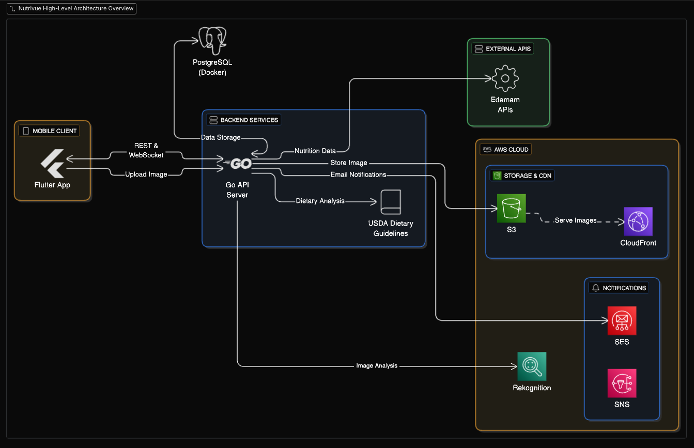

# 📱 Nutrivue Frontend (Flutter)

This is the **Flutter frontend** for the Nutrivue application.  
It provides the mobile user interface for authentication, meal logging, daily nutrition tracking, analytics, goals, onboarding, and profile management.

The app is built with **feature-first architecture** and a **shared core layer**, powered by **Riverpod**, **Dio**, and **FlutterSecureStorage**.

---

## 🖼️ Architecture Overview



---

## 📌 Features

- **Authentication**: Login, MFA, and password reset flows.
- **Home Dashboard**: Goals, nutrient breakdown, alerts, and recent meals.
- **Meal Logging**: Add meals manually or via AI-powered food recognition.
- **Goals & Analytics**: Track daily goals, view weekly/monthly summaries.
- **Notifications**: Push alerts for food safety, reminders, and updates.
- **Onboarding**: Guided setup with profile, preferences, and MFA toggle.
- **Profile**: Manage user data, app settings, privacy/security.

---

## 🏗️ Project Structure

```
lib/
├── core/                     # Shared building blocks
│   ├── providers/            # Riverpod providers (API, storage)
│   ├── services/             # API + secure storage services
│   ├── theme/                # Colors, typography, themes
│   └── widgets/              # Common UI (nav bar, app bar, etc.)
│
├── features/                 # Feature-first vertical slices
│   ├── home/                 # Dashboard & widgets
│   ├── auth/                 # Login, MFA, forms
│   ├── meal_logging/         # Food & meal management
│   ├── goals/                # Goals tracking, DGA-based estimators
│   ├── analytics/            # Weekly/monthly charts
│   ├── notifications/        # Device + alert providers
│   ├── onboarding/           # Guided setup flow
│   ├── profile/              # Profile, security, app info
│   └── splash/               # Splash screen
│
├── app.dart                  # Root app configuration
└── main.dart                 # Entry point
```

---

## 🔄 Data Flow (Home Dashboard Example)

```
DashboardScreen
  ⭢ reads dashboardProvider (FutureProvider)
  ⭢ HomeRepository.fetchDashboard(date)
  ⭢ HomeService (Dio + token from SecureStorage)
     - GET /user/goals-by-date
     - GET /user/nutrient-breakdown-by-date
     - GET /user/meal-items/recent
     - GET /user/meals/warnings
  ⭢ Repository parses JSON → models, derives alerts → DashboardData
  ⭢ Provider returns DashboardData
  ⭢ UI renders widgets with typed, UI-ready props
```

---

## 🚀 Getting Started

### 1. Prerequisites
- Flutter SDK (>=3.0)
- Dart (>=3.0)
- Android Studio / Xcode setup
- Backend service running (see NutriSafe Backend)

### 2. Clone the repo
```bash
git clone https://github.com/your-username/nutrisafe-frontend.git
cd nutrisafe-frontend
```

### 3. Install dependencies
```bash
flutter pub get
```

### 4. Configure environment
Create a `.env` file (use flutter_dotenv):

```env
API_BASE_URL=https://your-backend.com/api
```

### 5. Run the app
```bash
flutter run
```

---

## 🛠️ Tech Stack

- **Framework**: Flutter (Dart)
- **State Management**: Riverpod + hooks
- **HTTP Client**: Dio
- **Secure Storage**: flutter_secure_storage
- **Charts**: fl_chart (or equivalent)
- **Theming**: Custom AppTheme + AppColors